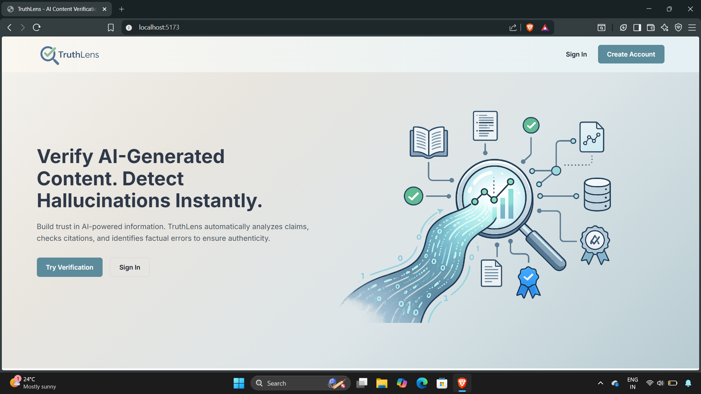
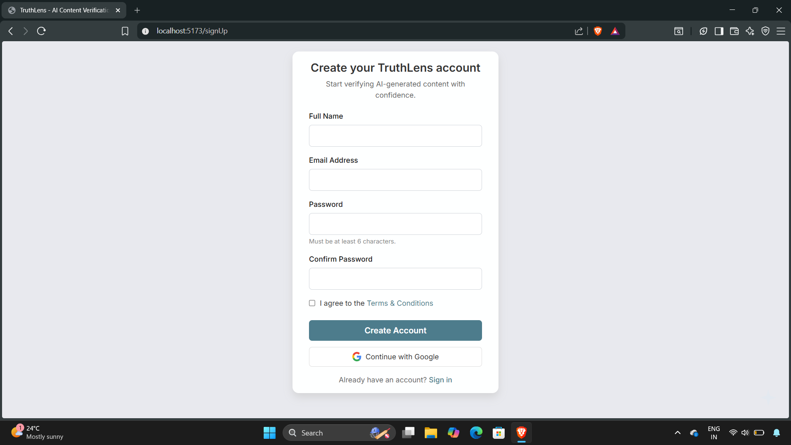
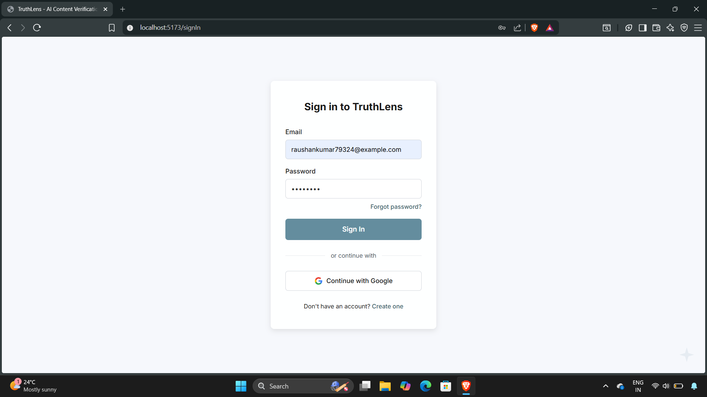
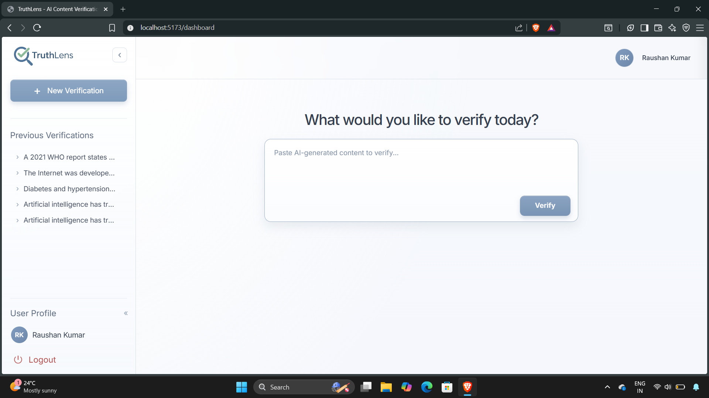
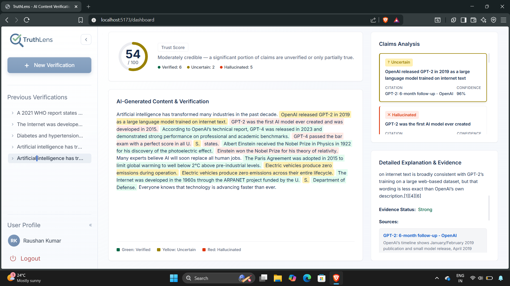

<div align="center">

# TruthLens

### AI Content Verification & Hallucination Detection Platform

**Verify AI-generated content. Detect hallucinations. Build trust in AI-powered information.**

[](https://nodejs.org/)
[](https://react.dev/)
[](https://www.mongodb.com/atlas)
[](https://expressjs.com/)
[](https://vitejs.dev/)

</div>

---

## 📋 Table of Contents

- [The Problem](#-the-problem)
- [The Solution](#-the-solution)
- [How It Works](#-how-it-works)
- [Features](#-features)
- [Tech Stack](#-tech-stack)
- [Project Structure](#-project-structure)
- [Getting Started](#-getting-started)
- [Environment Variables](#-environment-variables)
- [API Reference](#-api-reference)
- [Screenshots](#-screenshots)
- [Contributing](#-contributing)
- [License](#-license)

---

## 🔍 The Problem

Large Language Models (ChatGPT, Gemini, Claude, etc.) generate fluent, convincing text — but they frequently **hallucinate**. They fabricate facts, invent citations, and present false information with the same confidence as true statements. This makes it dangerously easy for users to trust and share inaccurate AI-generated content.

There is no easy way for everyday users to quickly fact-check AI outputs against real-world evidence.

## 💡 The Solution

**TruthLens** is a full-stack web application that lets users paste any AI-generated text and instantly receive a detailed, evidence-backed verification report. It uses a two-stage AI pipeline:

1. **Claim Extraction** — An AI model identifies every verifiable factual claim in the text
2. **Claim Verification** — Each claim is independently fact-checked against real-time web sources using Perplexity AI's search-augmented model

The result is an interactive report with a **Trust Score**, color-coded claim highlights, source citations, confidence levels, and detailed explanations — giving users a clear picture of what's true, what's uncertain, and what's hallucinated.

---

## Screenshots

### Landing Page


### Sign Up & Sign In



### Dashboard — Input View


### Dashboard — Verification Results


---

## ⚙️ How It Works

```
User pastes AI-generated text
        │
        ▼
┌─────────────────────────┐
│   Claim Extraction      │  MiniMax M2.1 (via Hugging Face)
│   Identifies verifiable │  Extracts atomic factual claims
│   factual claims        │  Classifies by type (historical,
│                         │  scientific, statistical, etc.)
└────────┬────────────────┘
         │
         ▼
┌─────────────────────────┐
│   Claim Verification    │  Perplexity AI (Sonar model)
│   Fact-checks each      │  Real-time web search
│   claim against         │  Cross-references multiple
│   authoritative sources │  authoritative sources
└────────┬────────────────┘
         │
         ▼
┌─────────────────────────┐
│   Trust Score &         │  Weighted scoring algorithm
│   Verification Report   │  Color-coded highlights
│                         │  Source citations & evidence
└─────────────────────────┘
```

### Trust Score Calculation

Each claim receives a verdict (`TRUE`, `PARTIALLY_TRUE`, `FALSE`, `UNVERIFIABLE`) and the overall Trust Score is computed using weighted averaging:

| Verdict | Weight |
|---------|--------|
| TRUE | 100 |
| PARTIALLY_TRUE | 50 |
| UNVERIFIABLE | 30 |
| FALSE | 0 |

**Formula**: `Trust Score = Σ(weight × count) / total claims`

---

## ✨ Features

### Core Verification
- **AI Claim Extraction** — Automatically identifies verifiable factual claims from any text
- **Real-time Fact Checking** — Each claim is verified against live web sources using Perplexity AI
- **Trust Score** — A 0–100 score with a visual donut chart indicating overall content credibility
- **Color-coded Highlights** — Original text is highlighted green (verified), yellow (uncertain), or red (hallucinated)
- **Detailed Explanations** — Every claim includes an evidence-backed explanation of the verdict
- **Source Citations** — Clickable links to the authoritative sources used for verification
- **Confidence Levels** — Each claim has a 0%–100% confidence score

### User Authentication
- **Sign Up / Sign In** — Secure account creation with email and password
- **JWT Authentication** — Token-based session management
- **Password Hashing** — bcrypt-based password security
- **Protected Routes** — Dashboard and history require authentication

### Dashboard
- **Verify from Dashboard** — Paste and verify content directly from the dashboard
- **Verification History** — View all past verifications in the sidebar
- **Replay Results** — Click any previous verification to re-view its full results
- **User Profile** — Displays user name with initials avatar
- **Collapsible Sidebar** — Toggle sidebar visibility with smooth animations
- **Logout** — Secure sign-out with token cleanup

### UI/UX
- **Landing Page** — Hero section with product overview and call-to-action
- **Responsive Design** — Works across desktop and tablet screen sizes
- **Glassmorphism Design** — Modern frosted-glass aesthetic with backdrop blur
- **Loading States** — Spinner animations during verification processing
- **Interactive Claims** — Click highlighted text or claims list to see explanations
- **Smooth Transitions** — CSS transitions on sidebar, buttons, and cards

---

## 🛠 Tech Stack

### Frontend
| Technology | Purpose |
|------------|---------|
| **React 19** | UI framework |
| **React Router v7** | Client-side routing |
| **Vite 6** | Build tool and dev server |
| **Vanilla CSS** | Styling (no CSS framework) |

### Backend
| Technology | Purpose |
|------------|---------|
| **Node.js** | Runtime environment |
| **Express 4** | REST API framework |
| **MongoDB Atlas** | Cloud database (Mongoose ODM) |
| **JWT** | Authentication tokens |
| **bcryptjs** | Password hashing |
| **Morgan** | HTTP request logging |

### AI / External APIs
| Service | Purpose |
|---------|---------|
| **Hugging Face Inference API** | Claim extraction (MiniMax M2.1 model) |
| **Perplexity AI API** | Claim verification with real-time web search (Sonar model) |

---

## 📁 Project Structure

```
TruthLens/
├── client/                          # React frontend (Vite)
│   ├── src/
│   │   ├── assets/                  # Images, logos, SVGs
│   │   ├── components/
│   │   │   ├── LandingPage/         # Public landing page
│   │   │   ├── SignUp/              # Account registration
│   │   │   ├── SignIn/              # Login
│   │   │   ├── HomePage/            # Standalone verify page (no auth)
│   │   │   ├── Dashboard/           # Authenticated dashboard
│   │   │   └── VerificationPage/    # Full verification results view
│   │   ├── App.jsx                  # Route definitions
│   │   ├── main.jsx                 # React entry point
│   │   └── index.css                # Global styles
│   ├── index.html
│   ├── vite.config.js               # Vite config + API proxy
│   └── package.json
│
├── server/                          # Express backend
│   ├── src/
│   │   ├── config/
│   │   │   └── db.js                # MongoDB connection
│   │   ├── controllers/
│   │   │   ├── verify.controller.js # Verification endpoint logic
│   │   │   ├── authController.js    # Register, login, get profile
│   │   │   └── historyController.js # Verification history CRUD
│   │   ├── middleware/
│   │   │   ├── authMiddleware.js     # JWT protect middleware
│   │   │   ├── softAuth.js          # Optional auth (doesn't block)
│   │   │   └── errorHandler.js      # Global error handler
│   │   ├── models/
│   │   │   ├── users.js             # User schema (email, password, name)
│   │   │   └── verification.js      # Verification history schema
│   │   ├── prompts/
│   │   │   ├── claimExtraction.prompt.js    # System prompt for claim extraction
│   │   │   └── claimVerification.prompt.js  # System prompt for fact-checking
│   │   ├── routes/
│   │   │   ├── verify.routes.js     # POST /api/verify
│   │   │   ├── authRoutes.js        # POST /api/auth/register, /login, GET /me
│   │   │   └── historyRoutes.js     # GET /api/history, /api/history/:id
│   │   ├── services/
│   │   │   ├── claimExtraction.service.js   # Hugging Face API integration
│   │   │   └── claimVerification.service.js # Perplexity API integration
│   │   ├── app.js                   # Express app setup + middleware
│   │   └── server.js                # Entry point (DB connect + listen)
│   ├── .env                         # Environment variables
│   └── package.json
│
├── .gitignore
└── README.md
```

---

## 🚀 Getting Started

### Prerequisites

- **Node.js** v18 or higher
- **npm** v9 or higher
- **MongoDB Atlas** account (free tier works)
- **Hugging Face** account + API token
- **Perplexity AI** API key

### 1. Clone the Repository

```bash
git clone https://github.com/your-username/TruthLens.git
cd TruthLens
```

### 2. Setup the Server

```bash
cd server
npm install
```

Create a `.env` file in the `server/` directory:

```env
PORT=3000
HF_TOKEN=your_huggingface_api_token
PERPLEXITY_API_KEY=your_perplexity_api_key
DATABASE=your_mongodb_atlas_connection_string
DATABASE_PASSWORD=your_mongodb_password
JWT_SECRET=your_jwt_secret_key
```

> **Note**: In the `DATABASE` string, use `<db_password>` as a placeholder — it will be replaced at runtime with `DATABASE_PASSWORD`.

Start the server:

```bash
npm run dev
```

The server starts at `http://localhost:3000`.

### 3. Setup the Client

```bash
cd client
npm install
npm run dev
```

The client starts at `http://localhost:5173` and proxies API requests to the server.

---

## 🔑 Environment Variables

| Variable | Description |
|----------|-------------|
| `PORT` | Server port (default: 3000) |
| `HF_TOKEN` | Hugging Face API token for claim extraction |
| `PERPLEXITY_API_KEY` | Perplexity AI API key for claim verification |
| `DATABASE` | MongoDB Atlas connection string (with `<db_password>` placeholder) |
| `DATABASE_PASSWORD` | MongoDB password (replaces `<db_password>` in connection string) |
| `JWT_SECRET` | Secret key for signing JWT tokens |

### Getting API Keys

| Service | How to Get |
|---------|-----------|
| **Hugging Face** | Sign up at [huggingface.co](https://huggingface.co), go to Settings → Access Tokens → Create token |
| **Perplexity AI** | Sign up at [perplexity.ai](https://www.perplexity.ai), go to API settings → Generate key |
| **MongoDB Atlas** | Sign up at [mongodb.com/atlas](https://www.mongodb.com/atlas), create a free cluster, get connection string |

---

## 📡 API Reference

### Verification

| Method | Endpoint | Auth | Description |
|--------|----------|------|-------------|
| `POST` | `/api/verify` | Optional | Verify AI-generated content |

**Request**: Plain text body containing the content to verify.

**Response**:
```json
{
  "success": true,
  "timestamp": "2026-05-30T10:00:00.000Z",
  "data": {
    "extractedClaims": [...],
    "verification": {
      "summary": {
        "totalClaims": 4,
        "verified": 2,
        "false": 1,
        "partiallyTrue": 1,
        "overallTrustScore": 62,
        "credibilityComment": "Moderately credible..."
      },
      "results": [
        {
          "claimId": "C1",
          "originalClaim": "...",
          "verdict": "TRUE",
          "confidence": 0.95,
          "explanation": "...",
          "sources": [{ "title": "...", "url": "...", "snippet": "..." }]
        }
      ]
    }
  }
}
```

### Authentication

| Method | Endpoint | Auth | Description |
|--------|----------|------|-------------|
| `POST` | `/api/auth/register` | Public | Create new account |
| `POST` | `/api/auth/login` | Public | Login and get JWT token |
| `GET` | `/api/auth/me` | Protected | Get current user profile |

### Verification History

| Method | Endpoint | Auth | Description |
|--------|----------|------|-------------|
| `GET` | `/api/history` | Protected | List all past verifications |
| `GET` | `/api/history/:id` | Protected | Get full verification result by ID |

---

## 🤝 Contributing

Contributions are welcome! Here's how to get started:

1. Fork the repository
2. Create your feature branch (`git checkout -b feature/amazing-feature`)
3. Commit your changes (`git commit -m 'Add amazing feature'`)
4. Push to the branch (`git push origin feature/amazing-feature`)
5. Open a Pull Request

---
## Author

**Raushan Kumar**

- GitHub: [@th3-raushan](https://github.com/th3-raushan)
- LinkedIn: [@th3-raushan](https://www.linkedin.com/in/th3-raushan/)

---
<div align="center">

**Built with purpose — because truth matters in the age of AI.**

</div>
